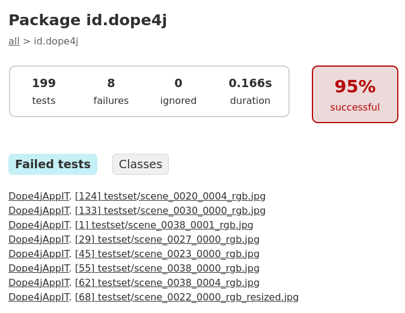
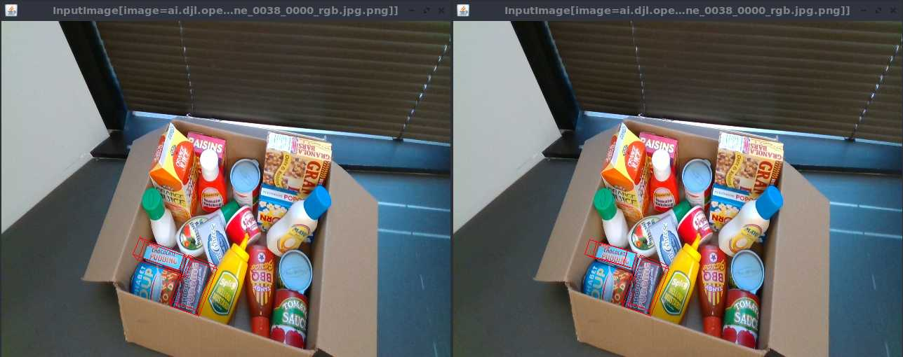

# Conformance to DOPE original results

`dope4j` implements tests which check that its results are similar to the results produced by the original DOPE decoder.

It was observed that main difference between pose calculated in `dope4j` and DOPE comes from affinity values produced by the DOPE networks. For example:

- In Java using ChocolatePudding.onnx model:
```
Affinities shape (16, 60, 80) (slice 0:3, 0:3, 0:3: ND: (3, 3, 3) gpu(0) float32
[[[ 4.58797440e-05,  3.68113630e-04,  3.32714058e-04],
  [ 7.89482147e-06,  2.51215883e-04,  1.78213231e-04],
  [ 1.13565475e-04,  2.53423117e-04,  1.56077556e-04],
 ],
 ...
 ])
```

- In Python using ChocolatePudding.pth model:
```
tensor([[[ 4.5880e-05,  3.6811e-04,  3.3271e-04,  ...,  6.4814e-04,
           6.6790e-04,  1.5093e-03],
         [ 7.8948e-06,  2.5122e-04,  1.7822e-04,  ...,  5.2576e-04,
           5.8982e-04, -3.0500e-04],
         [ 1.1357e-04,  2.5342e-04,  1.5607e-04,  ...,  3.6710e-04,
           2.6814e-04,  5.1003e-04],

```

As we can see 1.135(6)5475e-04 != 1.135(7)e-04. This 0.0001 delta during pose calculation can increase up to 0.1. Such increase happens mostly when not all vertices were detected and decoders have to fall back to [SOLVEPNP_P3P](https://docs.opencv.org/3.4/d9/d0c/group__calib3d.html#ga549c2075fac14829ff4a58bc931c033d) method.

To summarize: it is expected to have a some delta between `dope4j` and DOPE results.

# Comparison results

The comparison was done for ChocolatePudding on [Household Objects for Pose Estimation (HOPE) dataset](https://github.com/swtyree/hope-dataset/)

```
@inproceedings{tyree2022hope,
  author={Tyree, Stephen and Tremblay, Jonathan and To, Thang and Cheng, Jia and Mosier, Terry and Smith, Jeffrey and Birchfield, Stan},
  title={6-DoF Pose Estimation of Household Objects for Robotic Manipulation: An Accessible Dataset and Benchmark},
  booktitle={International Conference on Intelligent Robots and Systems (IROS)},
  year={2022}
}
```

The allowed delta between both results was set to 0.0999.



For 8 failed tests from total 199 the difference was mostly not significant like here (on all images below dope4j result on the left side and DOPE on the right):



- DOPE:
```
"poses": [
  {
    "position": {
      "x": -13.009053297465291,
      "y": 12.623985438342013,
      "z": 87.54625275751506
    }
  },
  {
    "position": {
      "x": -5.464752249609119,
      "y": 16.25970777221808,
      "z": 75.87259106423251
    }
  }
]
```
- dope4j:
```
"poses": [
  {
    "position": {
      "x": -10.3994380475,
      "y": 11.1743056245,
      "z": 73.9245146592
    }
  },
  {
    "position": {
      "x": -5.4648787834,
      "y": 16.2598811686,
      "z": 75.8732746167
    }
  }
]
```
